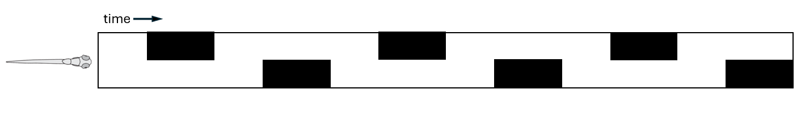
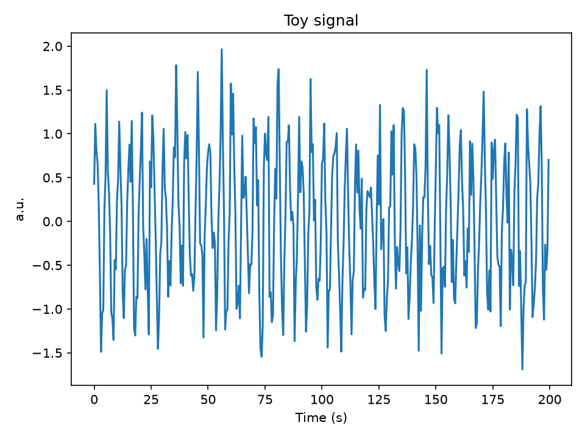
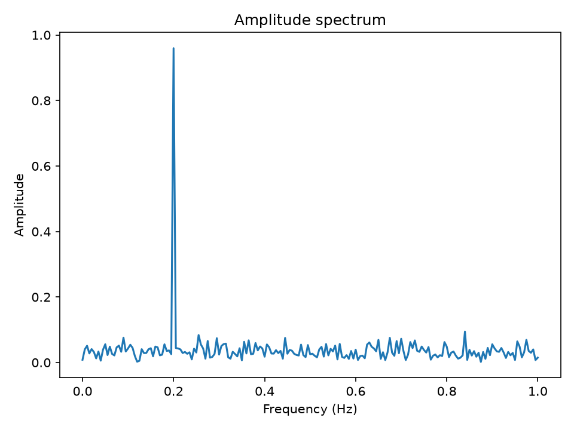

# Fourier-Transform Decoding of Periodic Neural Dynamics in Zebrafish Calcium Imaging

- **Manuscript (PDF):** [Download](assets/Manuscript%20v0.3.pdf)
- **Code:** Browse [`demo/`](../demo/) and [`notebooks/`](../notebooks/)
- **Images:** See [`images/`](../images/)

## TL;DR
We propose a Fourier-based pipeline to identify stimulus-locked neurons under periodic perturbations in zebrafish calcium imaging, and validate it against conventional regression analysis on a public whole-brain dataset.

## What's here
- **Concept:** Extract amplitude (response strength) and phase (response timing) at the known stimulus frequency.
- **Why it helps:** Captures transient onset/offset responses that standard regression may miss.
- **Validation:** Agreement with regression-based labels, with complementary coverage of phase-shifted neurons.

## Key Results


<p>


</p>

<sub>A toy periodic signal (left) and its amplitude spectrum (right), generated by `demo/example_fft.py` — the same core idea (find the peak at the known stimulus frequency) that the full pipeline applies to every neuron.</sub>

The notebooks reproduce the full pipeline — from the periodic stimulus signal, through per-neuron Fourier decomposition and selection, to whole-brain spatial/phase maps and quantitative validation against regression analysis — matching every figure in the manuscript.

## Reproduce
```bash
python -m venv .venv
source .venv/bin/activate  # Windows: .venv\Scripts\activate
pip install -r requirements.txt
python -m jupyter notebook
```
Then open `notebooks/Intro_Fourier_Transformation.ipynb` (optional background on the DFT) followed by `notebooks/Fourier_Analysis_Demo.ipynb` (the full analysis pipeline). For a minimal, non-notebook example of the core FFT step, see `demo/example_fft.py`.

## Manuscript
The full write-up (methods, figures, validations) is in the PDF above.

## Contact
Jingpin Daniel Liu — liujingpio@gmail.com
